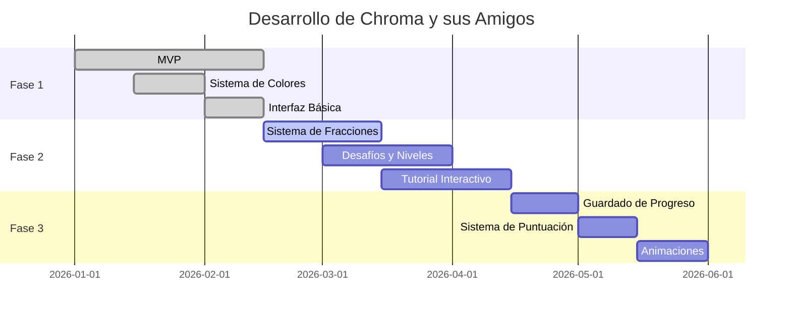

# 🏷️ Badges y Snippets para README

Este archivo contiene badges y snippets adicionales que puedes añadir a tu README.

## 📊 Badges Recomendados

### Estado del Proyecto
```markdown


```

### Build y Tests
```markdown


```

### Tecnologías
```markdown


```

### Stats
```markdown


```

### Social
```markdown

```

---

## 🎨 Secciones Visuales para el README

### Banner Superior

```markdown
<div align="center">
  
  
  # 🎨 Chroma y sus Amigos
  
  **Aprende colores y fracciones de forma divertida**
  
  [Demo](https://fertorm.github.io/Juegos/) • 
  [Documentación](docs/) • 
  [Reportar Bug](https://github.com/fertorm/Juegos/issues) • 
  [Solicitar Feature](https://github.com/fertorm/Juegos/issues/new?template=feature_request.md)
  
  
  
  
</div>
```

### Demo GIF

```markdown
## 🎮 Demo

<div align="center">
  
</div>

*Mezcla colores y aprende fracciones en tiempo real*
```

### Features con Emojis

```markdown
## ✨ Características

<table>
  <tr>
    <td align="center">
      <br/>
      <b>Mezcla de Colores</b><br/>
      Experimenta con colores primarios
    </td>
    <td align="center">
      <br/>
      <b>Aprende Fracciones</b><br/>
      Visualiza proporciones matemáticas
    </td>
    <td align="center">
      <br/>
      <b>Desafíos Divertidos</b><br/>
      Completa niveles educativos
    </td>
  </tr>
</table>
```

### Capturas de Pantalla

```markdown
## 📸 Capturas de Pantalla

<details>
<summary>Ver capturas</summary>

### Pantalla Principal


### Mezclador de Colores


### Vista de Fracciones


</details>
```

### Stack Tecnológico Visual

```markdown
## 🛠️ Construido Con

<div align="center">

| Frontend | Testing | Tools |
|----------|---------|-------|
|  |  |  |
|  |  |  |
|  | |  |

</div>
```

### Roadmap con Timeline

```markdown
## 🗺️ Roadmap


```

### Sección de Contribuidores

```markdown
## 👥 Contribuidores

¡Gracias a estas personas maravillosas! ([emoji key](https://allcontributors.org/docs/en/emoji-key))

<!-- ALL-CONTRIBUTORS-LIST:START -->
<table>
  <tr>
    <td align="center">
      <a href="https://github.com/fertorm">
        
        <br />
        <sub><b>Fernando Torres</b></sub>
      </a>
      <br />
      💻 📖 🎨 🤔
    </td>
  </tr>
</table>
<!-- ALL-CONTRIBUTORS-LIST:END -->

Este proyecto sigue la especificación de [all-contributors](https://github.com/all-contributors/all-contributors).
```

### Estadísticas del Proyecto

```markdown
## 📊 Estadísticas del Proyecto

<div align="center">


</div>
```

### Call to Action

```markdown
## 🌟 ¿Te Gusta el Proyecto?

Si encuentras este proyecto útil o interesante:

- ⭐ Dale una estrella en GitHub
- 🐛 [Reporta bugs](https://github.com/fertorm/Juegos/issues/new?template=bug_report.md)
- 💡 [Sugiere features](https://github.com/fertorm/Juegos/issues/new?template=feature_request.md)
- 🤝 Contribuye con código
- 📣 Compártelo con educadores y estudiantes

<div align="center">
  <a href="https://github.com/fertorm/Juegos/stargazers">
    
  </a>
  <a href="https://github.com/fertorm/Juegos/network/members">
    
  </a>
  <a href="https://twitter.com/intent/tweet?text=¡Mira%20este%20juego%20educativo!&url=https://github.com/fertorm/Juegos">
    
  </a>
</div>
```

### FAQ

```markdown
## ❓ Preguntas Frecuentes

<details>
<summary><b>¿Para qué edades es apropiado el juego?</b></summary>
<br>
El juego está diseñado para niños de 6-12 años, pero puede ser disfrutado por cualquier persona interesada en aprender sobre colores y fracciones.
</details>

<details>
<summary><b>¿Necesito conocimientos previos de programación para contribuir?</b></summary>
<br>
No necesariamente. Puedes contribuir de muchas formas: reportando bugs, sugiriendo features, mejorando la documentación, o ayudando con traducciones.
</details>

<details>
<summary><b>¿El juego funciona offline?</b></summary>
<br>
Actualmente no, pero está en nuestro roadmap implementar PWA para soporte offline.
</details>

<details>
<summary><b>¿Puedo usar este proyecto en mi escuela?</b></summary>
<br>
¡Por supuesto! El proyecto es de código abierto bajo licencia MIT. Puedes usarlo libremente con fines educativos.
</details>
```

### Footer

```markdown
---

<div align="center">

Hecho con ❤️ y ☕ por [Fernando Torres](https://github.com/fertorm)

[⬆ Volver arriba](#-chroma-y-sus-amigos)

</div>
```

---

## 🎯 Cómo Usar Estos Badges

1. **Copia el código** markdown que necesites
2. **Reemplaza los valores** (usuario, repo, versión, etc.)
3. **Pégalo en tu README.md**
4. **Personaliza** colores y textos según tu preferencia

### Generadores de Badges

- [Shields.io](https://shields.io/) - Generador principal
- [Simple Icons](https://simpleicons.org/) - Iconos de tecnologías
- [GitHub Readme Stats](https://github.com/anuraghazra/github-readme-stats) - Stats automáticos

---

## 📝 Notas

- Los badges mejoran la primera impresión del proyecto
- No abuses - 5-8 badges relevantes son suficientes
- Mantén los badges actualizados
- Usa colores que contrasten con tu tema
- Agrupa badges por categoría

---

¡Usa estos elementos para hacer tu README más atractivo y profesional! 🚀
